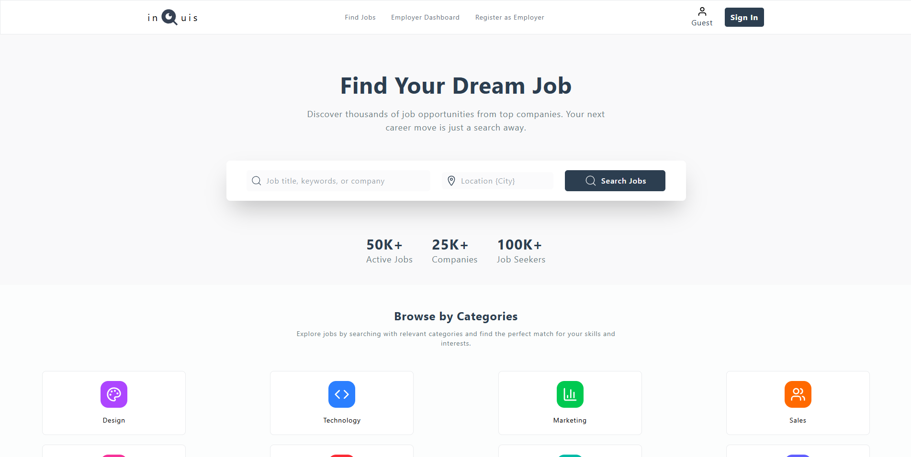
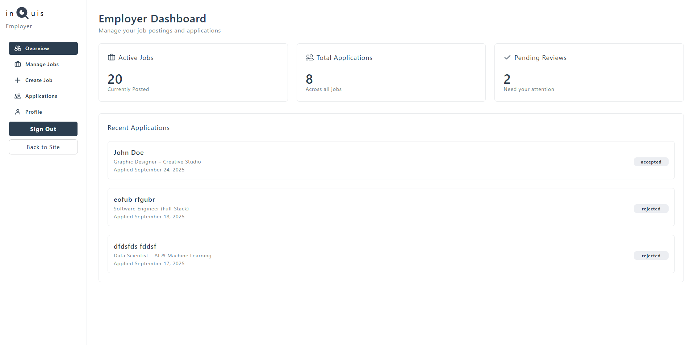
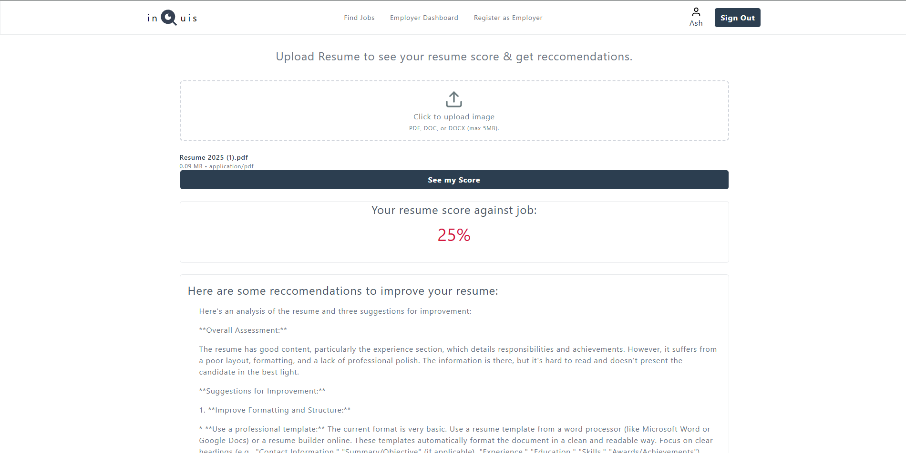
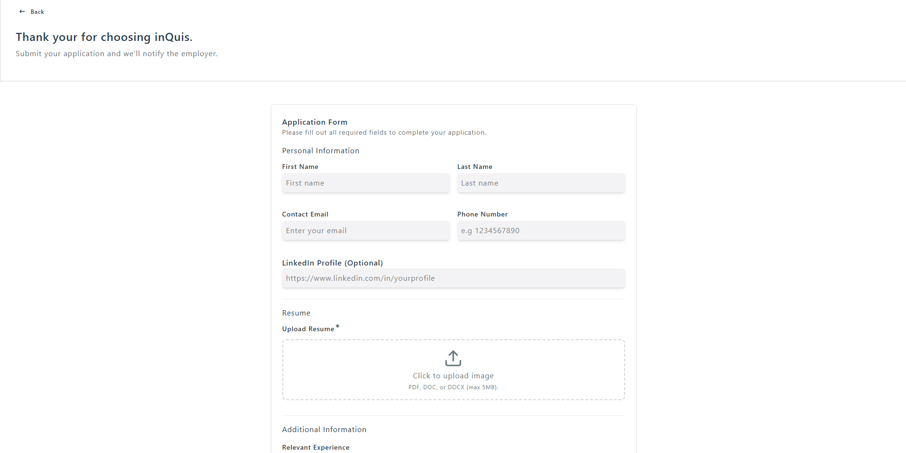
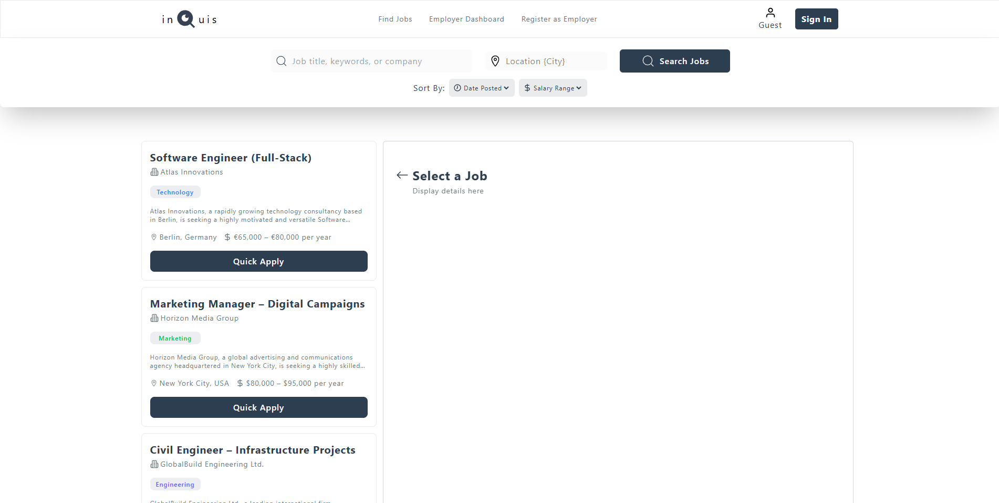

# 📝 inQuis Job Portal

A full-stack job portal designed to seamlessly connect job seekers and employers.  
Job seekers can apply for jobs, upload resumes, and receive a resume match score based on job descriptions using **Sentence Transformers**, along with email notifications for application status updates.  
Employers can pay a small fee via an integrated payment system to post jobs, manage postings, view applicants, and accept or reject applications.

---

## 🚀 Features

- 🧑‍💼 **Candidate Features**:
  - User registration, login, and profile management
- 💼 **Recruiter Features**:
  - Job creation, management, and application tracking
- 📄 **Resume Handling**:
  - Resume upload with AI-powered assessment
- 💳 **Payment Integration**:
  - Stripe-powered job posting payments
- 📧 **Notifications**:
  - Email updates via Brevo
- 🌐 **Media Storage**:
  - Cloudinary for storing media assets
- 🔐 **Security**:
  - Authentication and authorization using JWT
- 📊 **Dashboard**:
  - Centralized management for jobs and applications

---

## 🛠 Tech Stack

- **Frontend**:
  - React
  - Tailwind CSS
  - TanStack Query
  - Lucide Icons
- **Backend**:
  - Node.js
  - Express
  - JWT (authentication)
  - Stripe (payments)
  - Brevo (email service)
  - Cloudinary (media storage)
- **Database**:
  - MongoDB
- **Python Module**:
  - NLP-based resume analysis using PyPDF2 and Sentence Transformers
- **Deployment**:
  - Render (backend)
  - Vercel (frontend)
  - Hugging Face (Python module)

---

## 📂 Project Structure

```bash
inQuis-Job-Portal/
├── backend/                  # Express API
│   ├── controllers/          # API logic
│   ├── models/              # Database schemas
│   ├── routes/              # API routes
│   ├── middlewares/         # Custom middleware
│   └── server.js            # Entry point
├── frontend/                 # React application
│   ├── src/
│   │   ├── components/      # Reusable UI components
│   │   ├── pages/           # Page components
│   │   └── services/        # API service functions
│   └── package.json
├── python/                   # NLP and resume assessment
│   └── main.py              # Resume analysis script
├── assets/                   # Screenshots and demo images
│   └── screenshots/
│       ├── landingpage.png
│       ├── dashboard.png
│       ├── scoring.png
│       ├── applicationform.png
│       └── joblistings.png
└── README.md
```

---

## 🖼 Screenshots / Demo

Below are screenshots showcasing key features of the inQuis Job Portal:

  
*Landing page of the inQuis Job Portal*

  
*User dashboard for managing jobs and applications*

  
*Resume scoring interface with AI-powered assessment*

  
*Job application form with resume upload*

  
*Job listings page for browsing available positions*

---

## ⚙️ Installation & Setup

### 1️⃣ Clone the Repository

```bash
git clone https://github.com/AshutoshKuinkel/inQuis-Job-Portal.git
cd inQuis-Job-Portal
```

### 2️⃣ Install Dependencies

**Backend**:
```bash
cd backend
npm install
```

**Frontend**:
```bash
cd ../frontend
npm install
```

**Python Module**:
```bash
cd ../python
pip install -r requirements.txt
```

### 3️⃣ Configure Environment Variables

Create `.env` files in the `backend/` and `frontend/` directories using the provided `.env.example` as a reference.

**Example `.env` (backend)**:
```bash
PORT=5000
MONGO_URI=your_mongodb_uri
JWT_SECRET=your_jwt_secret
STRIPE_SECRET_KEY=your_stripe_key
CLOUDINARY_CLOUD_NAME=your_cloud_name
CLOUDINARY_API_KEY=your_cloud_api_key
CLOUDINARY_API_SECRET=your_cloud_api_secret
BREVO_API_KEY=your_brevo_api_key
```

### 4️⃣ Run the Project Locally

**Backend**:
```bash
cd backend
npm run dev
```

**Frontend**:
```bash
cd frontend
npm run dev
```

**Python Resume Assessment**:
```bash
cd python
python main.py
```

---

## 🧪 Running Tests

**Backend Tests**:
```bash
cd backend
npm run test
```

**Frontend Tests**:
```bash
cd frontend
npm run test
```

---

## 📦 Deployment

- **Frontend**: Vercel
- **Backend**: Render
- **Python Module**: Hugging Face

---

## 🤝 Contributing

1. Fork the repository
2. Create a feature branch:
   ```bash
   git checkout -b feature/your-feature
   ```
3. Commit your changes:
   ```bash
   git commit -m "Add new feature"
   ```
4. Push to the branch:
   ```bash
   git push origin feature/your-feature
   ```
5. Open a Pull Request

---

## 📜 License

This project is licensed under the MIT License. See the [LICENSE](./LICENSE) file for details.

---

## 🙌 Acknowledgements

- [React Docs](https://react.dev/)
- [Express Docs](https://expressjs.com/)
- [MongoDB Docs](https://www.mongodb.com/docs/)
- [PyPDF2](https://pypdf2.readthedocs.io/)
- [Sentence Transformers](https://www.sbert.net/)
- [Cloudinary Docs](https://cloudinary.com/documentation)
- [Stripe Docs](https://docs.stripe.com/)
- [Brevo API](https://developers.brevo.com/)